# Jaring Super Apps - Product Requirements Document (PRD)

**Nama Produk** : Jaring Super Apps (Jaring Hijau Nusantara)  
**Versi**       : 1.0  
**Tanggal**     : 31 Maret 2026  
**Platform**    : Progressive Web App (PWA) – Mobile Web App (Mobile-First)  
**Product Owner**: Amati Indonesia  

## 1. Overview

Jaring Super Apps adalah platform **sederhana tapi luar biasa** yang dibuat khusus untuk **Petani Mandiri** dan kelompok tani di seluruh Nusantara.  

Berdasarkan seluruh slide presentasi “Green Modern Bold Nature Forest Presentation.pdf”, aplikasi ini menyatukan dalam **satu tempat saja**:
- Assessment komunitas lokal
- Dashboard monitoring lahan & dana
- Pusat pelaporan
- Catatan hasil panen
- Manajemen kerusakan lahan
- Bantuan mentor + AI  

**Tujuan utama**:  
Membuat aplikasi yang **bisa dipakai oleh petani awam sekalipun** (gaptek, usia 35–60 tahun, HP low-end, sinyal lemah). Petani tidak perlu belajar rumit — cukup buka HP, tekan tombol besar, dan selesai. Semua data tersimpan otomatis, notifikasi lewat WhatsApp, dan bisa dipakai tanpa internet di sawah.

## 2. Requirements

### 2.1 Target Pengguna
- **Pengguna Utama**: Petani Mandiri & Ketua Kelompok Tani  
- **Pengguna Pendukung**: Mentor Wilayah & Admin Amati  
- **Kebutuhan Gaptek**:  
  - Offline 100% wajib  
  - Tombol besar (minimal 56px), font besar (18px+), warna kontras tinggi  
  - Bahasa Indonesia super sederhana (seperti ngobrol sehari-hari)  
  - Input suara (voice-to-text) untuk catat panen  
  - Notifikasi utama via WhatsApp  
  - Tutorial interaktif 3 menit saat pertama buka  

### 2.2 Problematika yang Diselesaikan (dari PDF)
- Assessment manual sulit dan lama  
- Dana & hasil panen tidak transparan  
- Kerusakan lahan terlambat diketahui  
- Pencatatan panen berantakan  
- Petani kesulitan minta bantuan mentor  

### 2.3 Fitur Pendukung Luar Biasa
- Integrasi cuaca (curah hujan, suhu, kelembaban, angin)  
- Integrasi harga pasar komoditas  
- Fokus utama: Kebun Pangan (nanti bisa tambah ternak/ikan/lebah)  

## 3. Core Features (Simple tapi Luar Biasa)

### 3.1 Assessment & Register
- Form langkah demi langkah (7 tab sederhana)  
- Generate token otomatis  
- Mentor review → status Basic / Intermediate / Advanced  
- Otomatis dapat rencana lahan & target  

### 3.2 Main Dashboard
- Ringkasan dana, progress tanaman, jadwal panen  
- Widget cuaca hari ini  
- 4 tombol besar cepat: Catat Panen • Lapor Kerusakan • Minta Dana • Chat Mentor  

### 3.3 Pusat Pelaporan
- 6 jenis laporan (General, Per Tanaman, Panen, Harian, Mingguan, Bulanan)  
- Tracking dana (Benih, Pupuk, Sarpras, dll)  
- Status: Approved / Revisi / Rejected  

### 3.4 Catatan Hasil Panen
- Pilih tanaman → isi tanggal, berat, kualitas, foto  
- Bisa pakai **suara** untuk input  
- Otomatis hitung target vs realisasi + jadwal rotasi  

### 3.5 Manajemen Kerusakan Lahan
- Lapor kerusakan (alat, bangunan, infrastruktur)  
- Status tiket + prioritas + SLA  
- Timeline perbaikan  

### 3.6 Bantuan & AI
- Chat AI (tanya apa saja tentang tanaman)  
- FAQ + Pusat Bantuan  
- Tombol “Hubungi Mentor” langsung WhatsApp  

### 3.7 Fitur Khusus Gaptek
- Voice input di semua form  
- Offline-First total (auto-sync saat online)  
- Mode “Mudah” dengan tombol ekstra besar  
- Onboarding interaktif pertama kali  

## 4. User Flow (Sangat Sederhana)

1. Buka aplikasi → Login dengan nomor HP (1 klik)  
2. Jika baru → Assessment dibimbing langkah demi langkah  
3. Masuk Dashboard (paling sering dibuka)  
4. Setiap hari:  
   - Lihat cuaca & notifikasi WhatsApp  
   - Tekan tombol besar “Catat Panen” atau “Lapor Kerusakan” (bisa offline)  
5. Mentor langsung lihat & balas via sistem + WhatsApp  

## 5. Architecture

```mermaid
graph TD
    A[Petani - HP Android Low-End] --> B[Frontend: Next.js + Tailwind PWA]
    B --> C[Service Worker + IndexedDB Offline]
    C --> D[Supabase Backend Realtime]
    D --> E[(PostgreSQL Database)]
    D --> F[WhatsApp Business API]
    D --> G[AI Assistant Grok/OpenAI]
    H[Mentor/Admin] --> D

---
## 6. Database Schema (Utama)


